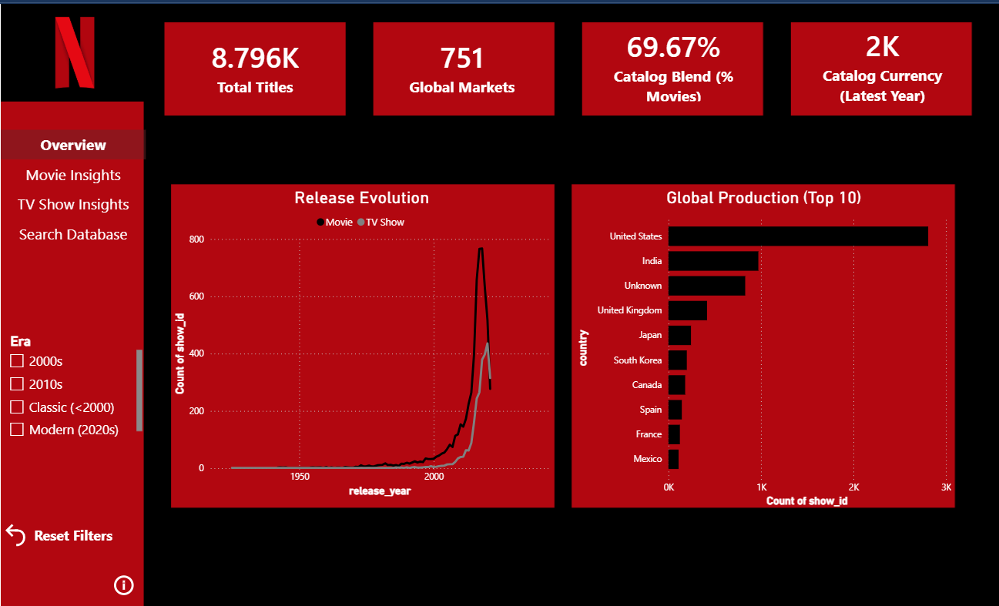

# Netflix Global Catalog Analytics Dashboard & Data Pipeline

## Project Description
This repository provides an end-to-end analytics and intelligence solution that cleans and analyzes the Netflix entertainment catalog around the world. This is accomplished by using a combination of data engineering and visualization techniques using Python (Pandas and Seaborn) and the interactive Power BI Desktop Dashboard, which creates complete pictures of content trends, genre trends, maturity scales, and catalog growth analysis.

## Live Links & Previews
* **Interactive Power BI Dashboard:** https://app.powerbi.com/view?r=eyJrIjoiODJmY2EwOWMtYzY4NC00Njg5LTkzMGQtMWI2NDNmYTMzY2VlIiwidCI6IjVhNzQwY2Q3LTU3NjgtNGQwOS1hZTEzLWY3MDZiMDlmYTIyYyIsImMiOjEwfQ%3D%3D
* **Exploratory Notebook:** https://github.com/warisha-sohail/netflix-data-analysis/blob/main/netflix_exploration.ipynb

## Dashboard Preview

*Figure 1: Multi-page interactive Power BI workspace tracking global production engines and catalog growth trends.*

## Tech Stack & Tools Used
* **Data Engineering & Scripting:** Python 3.x, Pandas, NumPy
* **Statistical Visualization:** Matplotlib, Seaborn, WordCloud
* **Business Intelligence & ETL:** Power BI Desktop, DAX (Data Analysis Expressions), Power Query
* **Eviornment:** Ubuntu Linux (VM)
* **Version Control:** Git (Iterative commit methodology)

## App Archtecture & UI Features
* **Tailored Nvigation Sidebar:** Built a custome web-app style left-hand navigation pane using structure geometry shapes and multi-state reactive buttons to toggle seamlessly between content views.
* **Smart Navigation Sync:** Leveraged stable **Page Navigation Actions** with custome page-level context locks rather than heavy bookmark layers to guarantee fast response times.
* **Global Utility Controls:** Integrated and advanced conditional **"Reset All Filters"** utility that targets global data parameters across pages without modifying layout views or disputing user orientation.
* **On-Demand Context Modals:** Developed a group-isolated **Information Pop-out window** utilizing native Show/Hide visual selection triggers tied directly to an interactive help action button.
* **Direct Text-Search Indexing:** Programmed an interactive exploratory catalog search engine using an open text-input slicer that enables full-string text matching over deep data tables instantly.

## Page-by-Page Field Mapping Coordinates
**1. Overview Page (Executive Summary Panel)**
* **Global Production (Clustered Bar Chart):**
  * *Axis/Y-Axis:* country (Filtered via Top N to isolate top 5 producers).
  * *Values/X-Axis:* Distinct Count of show_id
* **Release Evolution (Line Chart):**
  * *X-Axis:* release_year
  * *Y-Axis:* Count of show_id
  * *Legend:* type (Movie vs. TV Show split lines)
* **KPI Scorecards:**
  * Total Titles $\rightarrow$ Distinct Count of show_id
  * Global Markets $\rightarrow$ Distinct Count of country
  * Catalog Blend $\rightarrow$ Custom DAX percentage metric (Movie %)
  * Catalog Currency $\rightarrow$ Maximum of release_year

**2. Movie Insights Page (Film Analysis)**
 *Locked down via page-level filters where type is evaluated explicitly as "Movie".*
* **Movie Genres (Clustered Bar Chart):**
  * *Y-Axis:* listed_in (Top 5 Genres)
  * *X-Axis:* Count of show_id
* **Maturity Classifications (Clustered Column Chart):**
  * *X-Axis:* rating
  * *Y-Axis:* Count of show_id
* **KPI Scorecards:**
  * Total Movies $\rightarrow$ Count of show_id
  * Avg Movie Duration $\rightarrow$ Average of duration_numeric
  *  Classic Movies $\rightarrow$ Distinct Count of show_id (Filtered where release_year < 2000)

**3. TV Show Insights Page (Series Metrics)**
 *Locked down via page-level filters where type is evaluated explicitly as "TV Show".*
* **TV Ratings (Clustered Column Chart):**
  * *X-Axis:* rating
  * *Y-Axis:* Count of show_id
* **Top TV Genres (Donut Chart):**
  * *Legend:* listed_in
  * *Values:* Count of show_id
* **KPI Scorecards:**
  * Total TV Series $\rightarrow$ Count of show_id
  * Avg Series Lifespan $\rightarrow$ Average of seasons_numeric
  * Modern Era TV $\rightarrow$ Distinct Count of show_id (Filtered where release_year $\ge 2020$)

**4. Search Database (Deep-Dive Explorer)**
  * **Master Inventory (Table Grid):** Structured column sequences mapping out: title, type, director, cast, release_year, and rating.
  * **Global Finder (Text-Search Slicer):** Formatted search parameter mapping title to an open query text bar enabling direct dataset lookups.

## Data Pipeline & Custom DAX Transformations
**Python Data Engineering Highlights**
* **Structural Imputation:** Cleaned structural missing data loops for categorical identifiers like country, director, and cast, assigning UR (Unrated) safety labels for missing maturity fields.
* **Feature Extraction & Normalization:** Parsed raw strings into numeric values (e.g., "90 min" $\rightarrow$ 90 and "3 Seasons" $\rightarrow$ 3) to build duration_numeric arrays for runtime distributions.
* **Array Explosion:** Flattened nested variables like multi-listed genres (listed_in) and multi-country production cells (country) to isolate individual frequencies accurately.

## Power BI DAX Generation (Calculated Column)
Used to construct clean, clickable navigation filter tiles inside the sidebar menu by bucketing raw integers into era strings:

**Code Snippet**
 Era = 
SWITCH(
    TRUE(),
    'cleaned_netflix_titles'[release_year] < 2000, "Classic (<2000)",
    'cleaned_netflix_titles'[release_year] >= 2000 && 'cleaned_netflix_titles'[release_year] < 2010, "2000s",
    'cleaned_netflix_titles'[release_year] >= 2010 && 'cleaned_netflix_titles'[release_year] < 2020, "2010s",
    "Modern (2020s)"
)

## Dataset Schema Reference
 The project handles raw tracking logs utilizing the following data parameters:

* 'show_id: Unique identifier assigned per entry (Movie/TV Show).
* 'type': Broad categorization seperating 'Movie' and 'TV Show'.
* 'title': The officlal title of the content.
* 'director': Listed director(s) of the content.
* 'cast': Leading actors associated with the production
* 'country': Country or countries where production occured.
* 'date_added': Date the title was officially made available on Netflix.
* 'release_year: The original theartrical or broadcast launch year.
* 'rating': Content maturity rating (e.g., TV-MA, PG-13).
* 'duration': Raw text showing time duration framework (Minutes or Seasons).
* 'listed_in': Category classifications / Genres.
* 'descriptions': Short synopsis summary text.

## How to Run Locally on Ubuntu VM
**1. Clone & Set Up the Repository Workspace**

git clone https://github.com/yourusername/netflix-data-analysis.git
cd netflix-data-analysis

**2. Initialize the Python Virtual Environment**

python3 -m venv venv
source venv/bin/activate
pip install -r requirements.txt

**3. Execute the Automated Data Pipeline**

*Run the data engineering and cleaning module*

python3 src/data_processing.py

*Generate the static Seaborn charts* 

python3 src/visualizations.py

